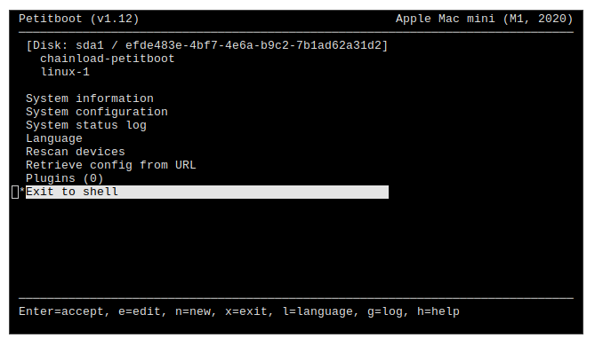

# Petitboot for Apple Silicon

This is a [Buildroot](https://buildroot.org) tree that builds a [Petitboot](http://www.kernel.org/pub/linux/kernel/people/geoff/petitboot/petitboot.html) image for M1 Macs (the computers from Apple). It builds on work in [glevand/petitboot--buildroot](https://github.com/glevand/petitboot--buildroot).

The resulting image expects to be loaded through [m1n1](https://github.com/AsahiLinux/m1n1/]).

*Figure: Petitboot prompt on Mac mini*

## Some features (or their absence)

 * Produces self-standing kernel images with the appropriate userspace embedded in.

 * Supports loading of custom devicetree blobs. You can associate a custom devicetree with a boot option. Petitboot shoud correctly transfer the runtime properties obtained from m1n1 into the new devicetree.

 * Supports USB Type-A and Ethernet on Mac mini. On Mac mini, the interim Petitboot kernel has support for the USB Type-A ports and Ethernet. For these to be brought up also in the final kernel, the final kernel needs to cope with the fact that they have already been initialized in the interim kernel. [This patch](https://github.com/povik/linux/commit/e927f1e23ade87d085b0f84a10fcc0b48aed6afe) makes it work, although I don't expect that to be the right approach.

 * Has no support for NVMe at the moment.

## How to configure the boot options

One way to configure the boot options Petitboot should offer is through a `kboot.conf` file on any storage device Petitboot can probe. [Look here](https://github.com/open-power/petitboot/blob/master/utils/kboot.conf.sample) for a sample.

Petitboot also has some support for reading other bootloader's configuration format, like GRUB's.

## Building

You can use `buildenv/enter.sh` to enter a Docker-based build container. Read `buildenv/Dockerfile` for dependencies if building outside the container.

	make apple_m1_petitboot_defconfig
	make -j4

The produced image will be at `output/images/Image.gz`.
